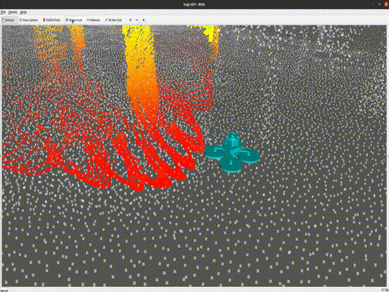
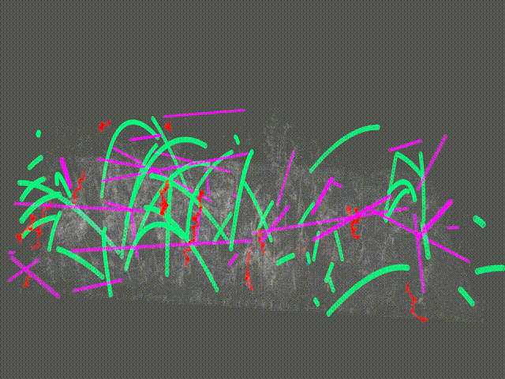
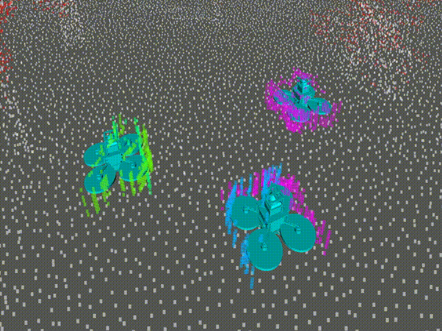
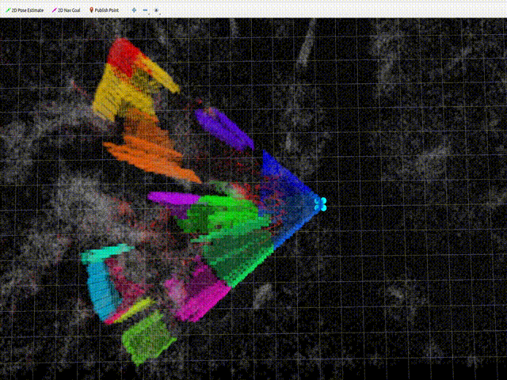

# MARSIM
MARSIM: 一款轻量级、点云逼真的LiDAR无人机模拟器
## 目录
[Achievements/ and/ Introduction](#Briefly Introduction and Achievements)

## Briefly Introduction and Achievements
1. 利用LiDAR扫描重建真实环境的点云地图
2. 硬件平台要求低，可在具有GPU加速的个人电脑上进行仿真
3. 支持三种类型的动态障碍物、多无人机系统仿真以及机械旋转LiDAR模型
论文已在Arxiv上发布: https://arxiv.org/abs/2211.10716

视频在YouTube上发布: https://youtu.be/hiRtcq-5lN0 and 
【MARSIM: 轻量化雷达无人机仿真器】 https://www.bilibili.com/video/BV1M84y117KG

<p align="center">
  <a href="https://youtu.be/hiRtcq-5lN0" target="_blank"></a>
</p>

<p align="center">

  

  


  


  
</p>

## Update

现已支持Ubuntu 20.04，可以在ubuntu20分支中找到。

已在发布包中发布了十个逼真的地图（低分辨率和高分辨率）。

已在fuel_ubuntu20分支中发布了与FUEL合并的新分支。

**已在发布包中发布了十个逼真的地图（低分辨率和高分辨率）**

**已在fuel_ubuntu20分支中发布了与FUEL合并的新分支**


## Prerequisited

### Ubuntu and ROS

Ubuntu 16.04~20.04.  [ROS Installation](http://wiki.ros.org/ROS/Installation).

### PCL && Eigen && glfw3

PCL>=1.6, 参考 [PCL Installation](https://pointclouds.org/). 

Eigen>=3.3.4, 参考 [Eigen Installation](https://eigen.tuxfamily.org/index.php?title=Main_Page).

glfw3:
```
sudo apt-get install libglfw3-dev libglew-dev
```

### Make
```
mkdir -p marsim_ws/src
cd marsim_ws/src
git clone git@github.com:hku-mars/MARSIM.git
cd ..
catkin_make
```

## Run single drone simulation

```
source devel/setup.bash
roslaunch test_interface single_drone_avia.launch
```
在Rviz上点击3Dgoal工具，您可以给无人机发送位置指令来控制其飞行。

目前，我们为用户提供了几个启动文件，可以在test_interface/launch文件夹中找到。

您可以更改启动文件中的参数来更改地图和需要模拟的LiDAR。地图已上传至此仓库的发布文件中。

```
    <arg name="map_name" value="$(find map_generator)/resource/small_forest01cutoff.pcd"/>

```

**如果您想使用MARSIM的GPU版本，请将参数"use_gpu"设置为true。**

## Run single drone simulation with dynamic obstacles
```
source devel/setup.bash
roslaunch test_interface single_drone_mid360_dynobs.launch
```

## Run multiple drones simulation
```
source devel/setup.bash
roslaunch test_interface triple_drone_mid360.launch
```

## Run the simulation with FUEL algorithm

您首先需要将分支切换到fuel_ubuntu20分支。如果您使用的是Ubuntu 20.04，您应该首先下载Nlopt并将其安装在您的环境中。然后，您可以通过以下命令运行仿真：

```
source devel/setup.bash
roslaunch exploration_manager exploration.launch
```
然后在Rviz上点击2Dgoal工具，随机点击地图，FUEL将自动运行。

## Acknowledgments
感谢 [FUEL](https://github.com/HKUST-Aerial-Robotics/FUEL.git)

## Future
我们将很快发布更逼真的地图和功能。
